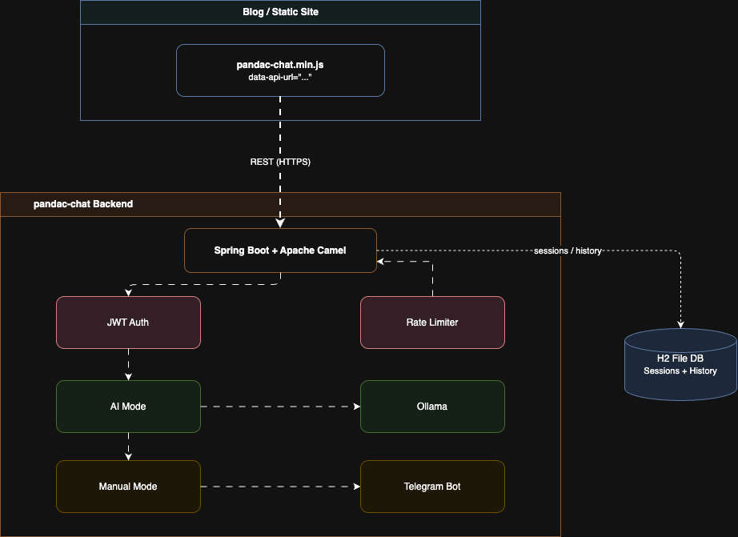

<div align="center">

# 💬 pandac-chat

**An AI-powered personal chat widget — embed it on any website in one line.**

[](https://github.com/pandaind/pandac-chat/actions)
[](LICENSE)
[](https://openjdk.org/projects/jdk/21/)
[](https://spring.io/projects/spring-boot)

*The AI doesn't answer as a generic assistant — it answers **as you**.*

</div>

---

## What is this?

`pandac-chat` is a self-hostable chat system where an AI model impersonates **you** — on your blog, portfolio, docs site, product page, or anywhere you can drop a `<script>` tag.

You write a `personal-context.txt` file describing yourself in first person, deploy the backend,
embed one `<script>` tag — and visitors can chat with your AI persona directly on your site.

**Backend:** Spring Boot + Apache Camel + Spring AI (Ollama)  
**Widget:** Zero-dependency vanilla JS, Shadow DOM isolated, 11 kB gzipped

---

## Architecture



---

## Quick Start (5 minutes)

### 1. Clone & configure

```bash
git clone https://github.com/pandaind/pandac-chat.git
cd pandac-chat/backend
cp .env.example .env
# Edit .env with your values
```

> ⚠️ `H2_PASSWORD` must be **alphanumeric only** — special characters (`$`, `!`, `@`) break JDBC parsing.

### 2. Write your personal context

Edit `backend/data/personal-context.txt` — describe yourself **in first person**.
This is what the AI reads to know how to speak as you.

### 3. Deploy

```bash
docker-compose up -d
```

Test it's working:
```bash
curl http://localhost:9097/api/config
# {"ownerName":"Your Name","chatTitle":"Chat with Me","avatarInitial":"Y"}
```

### 4. Embed the widget

Add this before `</body>` on any site — blog, portfolio, docs, product page:

```html
<script
  src="https://cdn.jsdelivr.net/gh/pandaind/pandac-chat@master/widget/dist/pandac-chat.min.js"
  data-api-url="https://your-backend-url.com"
  data-accent="#6C63FF"
  defer>
</script>
```

A floating chat button appears in the bottom-right of your site. Done.

---

## Widget Options

| Attribute | Default | Description |
|---|---|---|
| `data-api-url` | `http://localhost:8080` | URL of your deployed backend |
| `data-theme` | `dark` | `dark` or `light` |
| `data-accent` | `#6C63FF` | Primary accent color (any CSS color) |

The widget auto-fetches your name, title, and avatar initial from the backend — no hardcoding needed.

---

## Chat Modes

Set `CHAT_MODE` in your `.env`:

| Mode | Behaviour |
|---|---|
| `AI` | Ollama model responds automatically using your `personal-context.txt` |
| `MANUAL` | Messages are forwarded to your Telegram. You reply via the Telegram bot. |

Switch by changing the env var and restarting — no rebuild needed.

---

## Project Structure

```
pandac-chat/
├── backend/          Spring Boot + Camel + Spring AI backend
│   ├── src/
│   ├── data/
│   │   └── personal-context.txt   ← edit this to define your persona
│   ├── Dockerfile
│   ├── docker-compose.yml
│   └── .env.example
├── widget/           Embeddable vanilla JS chat popup
│   ├── src/
│   │   ├── pandac-chat.js
│   │   ├── styles.css
│   │   └── icons.js
│   ├── dist/
│   │   └── pandac-chat.min.js     ← built bundle (served via jsDelivr)
│   └── index.html                 ← local dev preview page
├── docs/             Full documentation
├── .github/          CI/CD workflows
├── LICENSE
└── README.md
```

---

## Development

### Backend

```bash
cd backend
cp .env.example .env && vim .env
export $(grep -v '^#' .env | xargs)
./mvnw spring-boot:run -Dspring-boot.run.profiles=dev
# Backend running at http://localhost:8080
# H2 console at http://localhost:8080/h2-console
```

### Widget (live reload)

```bash
cd widget
npm install
npm run dev
# Dev server at http://localhost:5173
# Points to backend at http://localhost:8080 by default
```

To produce a minified bundle for distribution:

```bash
npm run build
# Output: dist/pandac-chat.min.js (11 kB / 4 kB gzipped)
```

---

## CI/CD

| Workflow | Triggers when | Action |
|---|---|---|
| **Backend CI** | Push to `backend/` | Maven build + test (Java 21) |
| **Widget Build** | Push to `widget/src/` | Vite build → auto-commits `dist/` |

---

## Documentation

- [Getting Started](docs/getting-started.md)
- [Configuration Reference](docs/configuration.md)

---

## License

[MIT](LICENSE) © [Chittaranjan Panda](https://pandac.in)
