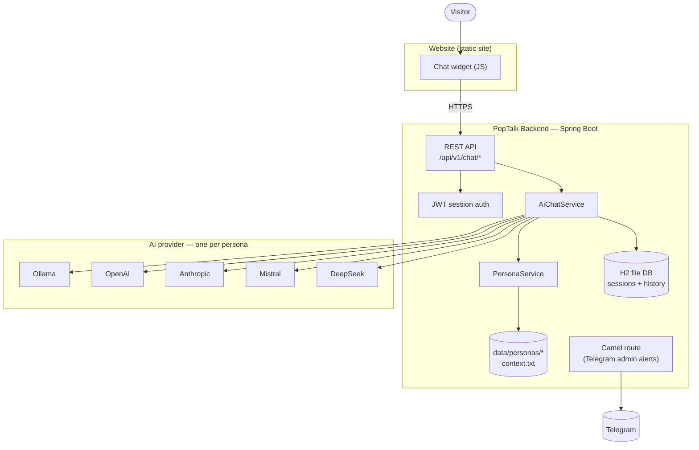
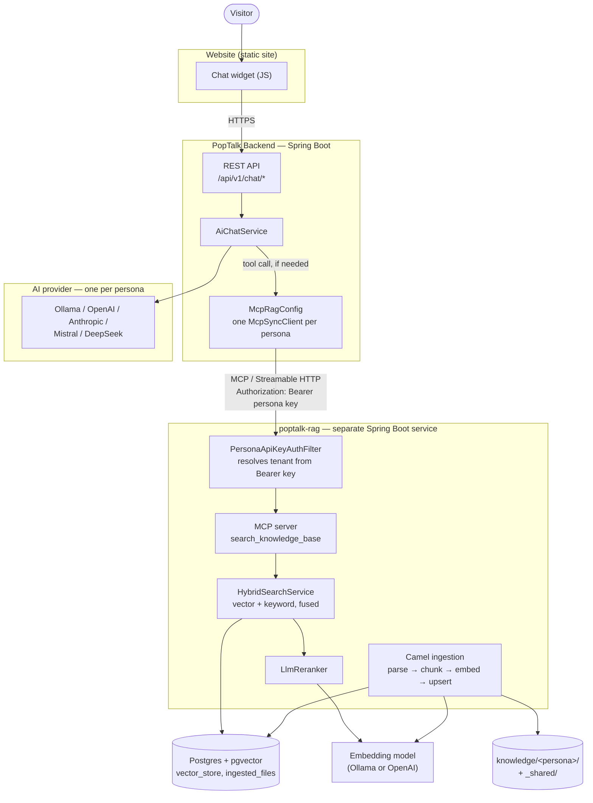

# Architecture

Two views of the same system: PopTalk on its own, and PopTalk with the
optional [poptalk-rag](https://github.com/pandaind/poptalk-rag) server
plugged in. RAG is additive — nothing in the first diagram changes when the
second one applies, it only gains new paths.

---

## Without RAG

A persona answers purely from its own system prompt — whatever is written
in its `context.txt` — using whichever provider that persona is configured
for.

- **AiChatService** picks the persona's configured provider and sends system
  prompt + history + message — one of five `ChatModel` beans, chosen per
  persona, not per deployment.
- **H2** is file-based, on disk with the app. It holds chat sessions and
  message history — no separate database to run.
- The **Telegram route** notifies an admin chat and is unrelated to the AI
  reply path — just an operational side-channel.

---

## With RAG

The same backend, unchanged — a persona with `mcp=true` also gets a tool the
model can call mid-conversation to pull from its own document set, served by
a second, independently deployed project.

- **Per-persona MCP client** — each persona with RAG enabled gets its own
  key and its own client, never one shared connection. That key is what
  poptalk-rag uses to decide whose documents a request can see.
- **Tenant isolation** — the persona id is never a parameter the model
  supplies. Only the authenticated key resolves it, so a prompt-injected
  visitor can't talk their way into another persona's documents.
- **Ingestion is decoupled** — documents dropped into the knowledge folder
  are picked up on a poll, independent of any live chat request. A
  visitor's question never waits on embedding work.

---

**What's actually new:** one config bean in PopTalk (`McpRagConfig`), and one
entire extra service (poptalk-rag) with its own database, its own embedding
calls, and its own deploy lifecycle. PopTalk itself doesn't know or care
that poptalk-rag exists beyond that one client — turn RAG off for a persona
and it behaves exactly like the first diagram again.
